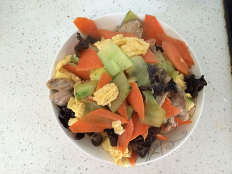
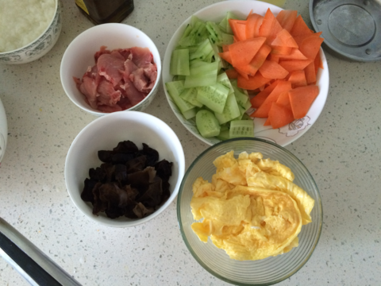
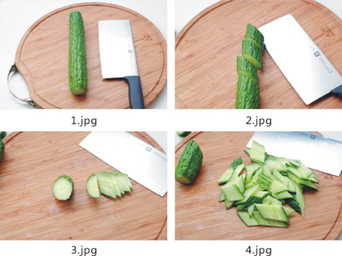
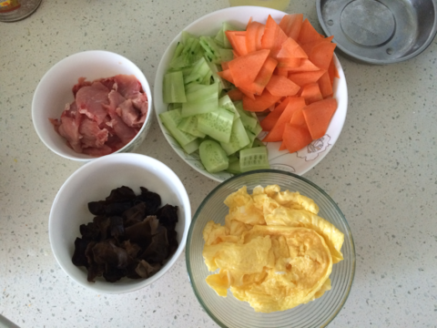

木须肉
===============================

## 食材 ##
* 瘦肉:4两
* 木耳:1小把
* 鸡蛋:3个
* 胡萝卜:0.5根
* 黄瓜:0.5根

## 步骤 ##

### 1. 木耳加水泡发备用，瘦肉切片备用，鸡蛋打散备用 ###

### 2. 黄瓜胡萝卜切成菱形备用 ###
切菱形片首先斜刀切大块，然后将斜块竖起切片。

### 3. 大火起锅加入油，待油热换小火，将鸡蛋入锅，均匀摊开，待成鸡蛋饼后盛出备用 ###

### 4. 锅内加入油，待油热后加入瘦肉片，放入料酒去腥，加入少量生抽提鲜 ###

### 5. 加入木耳、鸡蛋，胡萝卜和黄瓜片继续翻炒，同时加入盐等调料 ###

### 6. 翻炒至熟后，加入鸡精出锅 ###

