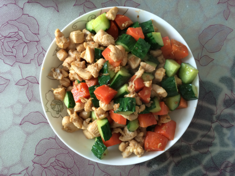
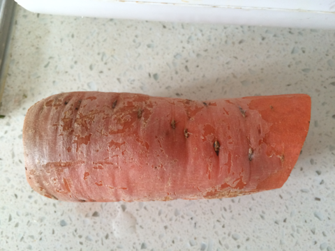
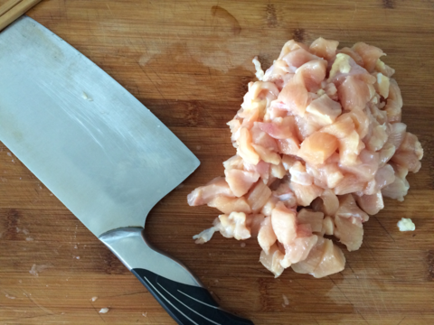
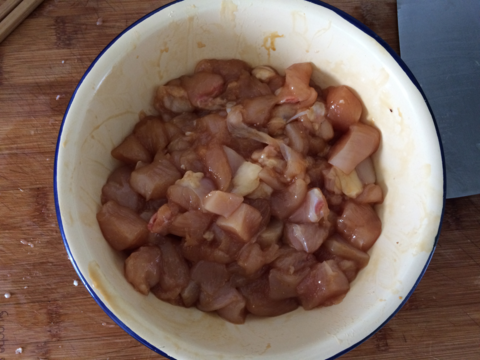
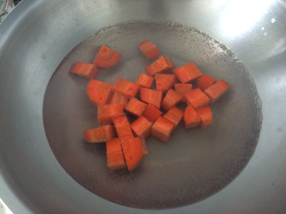
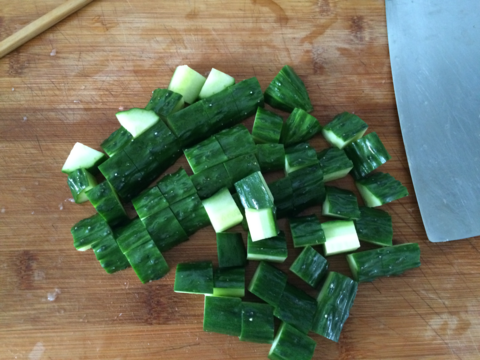
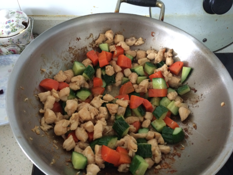
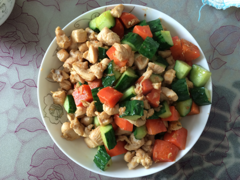

黄瓜胡萝卜炒鸡丁
===============================

## 食材 ##
* 鸡胸肉:整个鸡胸的0.5份
* 胡萝卜:0.5根
* 黄瓜:0.5根

## 步骤 ##

### 1.鸡胸肉切丁后，放入料酒和生抽腌制15分钟  ###

### 2.胡萝卜切丁  ###

### 3.将胡萝卜丁焯一下，冷水下锅，待水开后捞出 ###

### 4.黄瓜切丁  ###

### 5.锅加入少量油，待油热后下鸡丁，翻炒几下后，下入胡萝卜和黄瓜，加入调料 ##

## 继续翻炒至熟后出锅盛盘  ###

