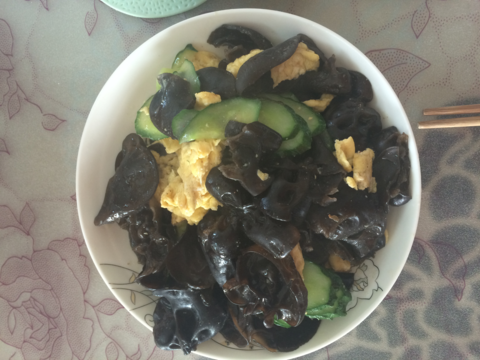
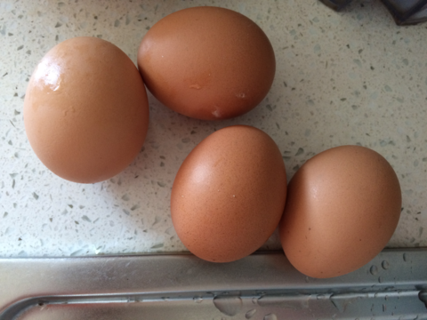
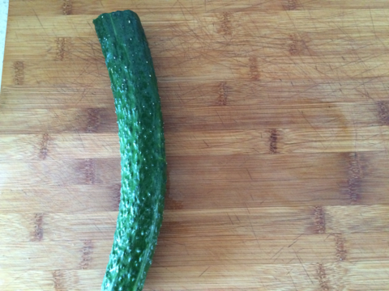
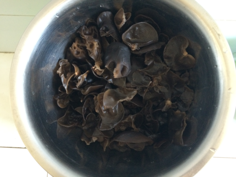
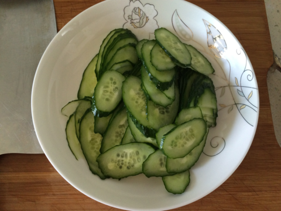
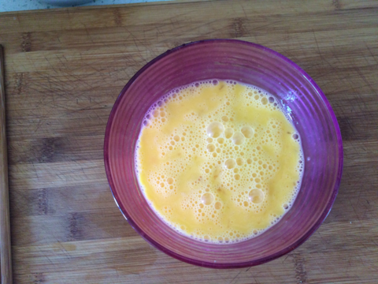

木耳黄瓜炒鸡蛋
===============================

## 食材 ##
* 鸡蛋:4个
* 黄瓜:1根
* 木耳:1把

## 步骤 ##

### 1. 木耳泡发后，撕成小块备用  ###

### 2. 黄瓜切片，备用 ###

### 3. 鸡蛋打散备用 ###

### 4. 锅中倒入油，待油四层热时，关小火倒入鸡蛋，摊成鸡蛋饼 ###

### 5. 待鸡蛋成饼后，放入木耳和黄瓜，放入调料继续翻炒至熟 ###

