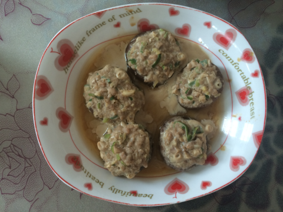
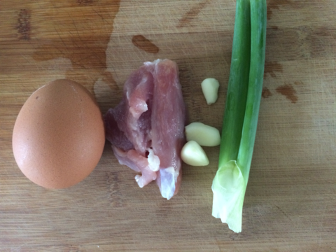
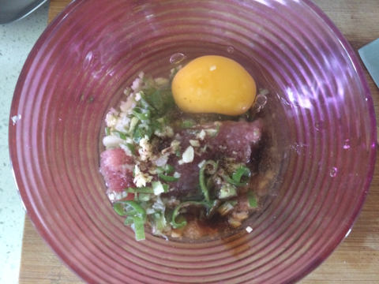

香菇酿
===============================

## 食材 ##
* 鸡蛋:1枚
* 香菇:若干
* 猪瘦肉:1两
* 葱姜蒜:少许

## 步骤 ##
### 1. 瘦肉剁馅，加入鸡蛋、葱末、姜末、蒜末、盐、糖、五香粉搅匀后，放置入味  ###

### 2. 香菇取缔 ###

### 3. 将腌制好的肉馅填入香菇上 ###

### 4. 锅中放入水，烧开后，将带肉馅的香菇入锅蒸5-10十分钟后出锅 ###
