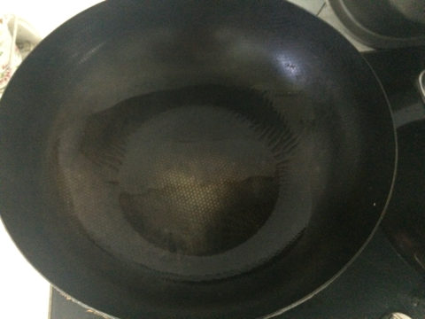

蛋包饭
===============================

## 食材 ##
炒饭的食材比较随意，可根据时令和家里有的食材随意选择。

* 米饭:1碗
* 鸡蛋:2个
* 香葱:若干
* 西红柿:0.5个
* 尖椒:1个
* 风干肠:0.5根

## 步骤 ##
### 1. 清洗食材：西红柿和香葱洗净；尖椒洗净去蒂； ###

### 2. 加工食材：尖椒、干肠和香葱切丁；鸡蛋打散； ###

### 3. 锅中加入油，###

### 4. 炒米饭：待油热后放入米饭，干肠，尖椒和香葱以及盐等调料小火翻炒后，盛入碗 ###

### 5. 煎蛋饼：不粘锅中加入油，待油热后换小火，倒入蛋液，轻轻转动锅，让蛋液铺满锅底 ###

### 6. 包饭：待蛋液凝固成蛋饼后，将蛋饼放入盘中，将米饭加入蛋饼一边，再蛋饼另一边对折 ###

### 7. 摆盘：西红柿切小块摆入盘中，蛋包饭完成 ###

